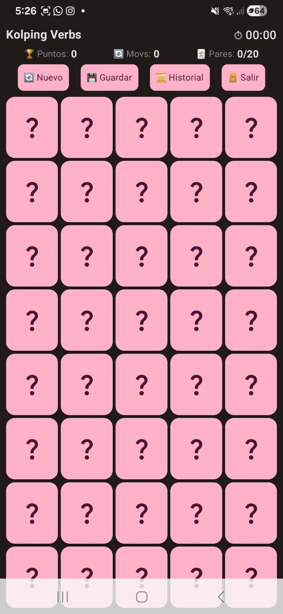
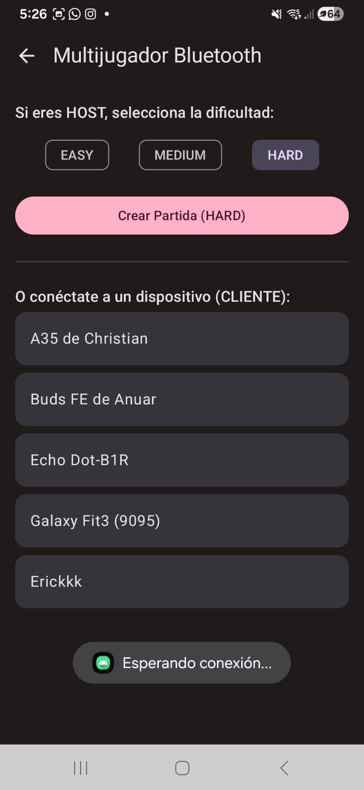
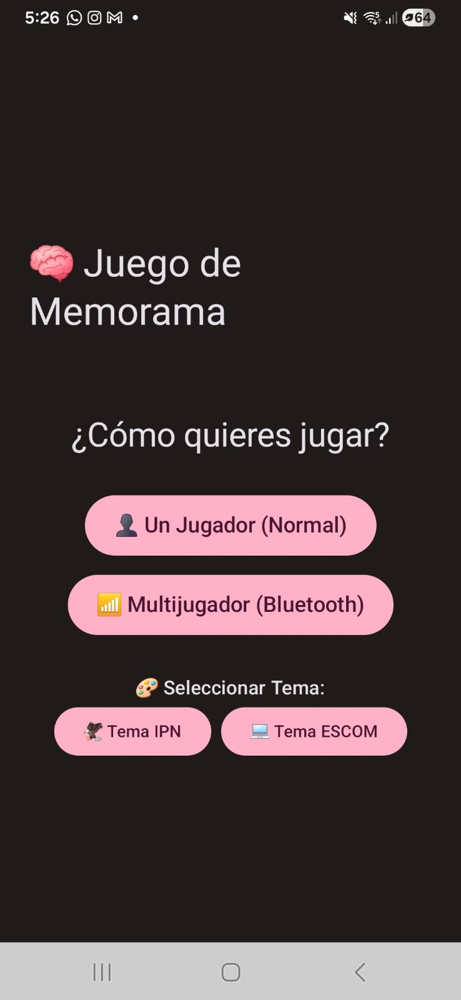

# 🎓 Kolping Verbs - Memorama Educativo

> **Proyecto de Acción Altruista y Tecnológica para Fundación Kolping**

## 📖 Descripción del Proyecto

**Kolping Verbs** es una aplicación móvil Android diseñada como herramienta de apoyo educativo para los estudiantes de bachillerato de la **Fundación Kolping (Sede Martín Carrera)**.

Este proyecto nace de la necesidad de reforzar el aprendizaje del idioma inglés de una manera dinámica y divertida. A diferencia de los métodos tradicionales de memorización, esta app utiliza la **gamificación** para ayudar a los alumnos a asociar verbos en inglés con su significado en español.

---

## 🎮 Características Principales

### 🧠 Lógica Educativa (Inglés - Español)
A diferencia de un memorama clásico que busca imágenes idénticas, este juego desafía cognitivamente al usuario a encontrar **pares semánticos**:
* 🃏 **Carta A:** "To Run" (Inglés)
* 🃏 **Carta B:** "Correr" (Español)

### 📱 Diseño Responsivo "Zero-Scroll"
La interfaz ha sido optimizada matemáticamente para adaptarse a cualquier tamaño de pantalla. El tablero calcula el espacio disponible y redimensiona las cartas para que todo el juego sea visible de un vistazo, **eliminando la necesidad de hacer scroll** y mejorando la concentración.

### ⚔️ Modo Multijugador Offline (Bluetooth)
Permite a dos estudiantes conectar sus dispositivos **sin necesidad de internet** para competir en tiempo real, fomentando el aprendizaje colaborativo en el aula.

### 💾 Historial y Progreso
Sistema de guardado local para pausar partidas y un historial para revisar puntuaciones y tiempos anteriores.

---

## 🛠️ Tecnologías Utilizadas

El proyecto sigue las mejores prácticas modernas de desarrollo Android:

* **Lenguaje:** Kotlin 100%
* **UI Toolkit:** Jetpack Compose (Declarative UI)
* **Arquitectura:** MVVM (Model-View-ViewModel)
* **Concurrencia:** Corrutinas & Flow (Manejo asíncrono y eventos de UI)
* **State Management:** StateFlow y MutableState.

---

## 📸 Capturas de Pantalla

| Menú Principal | Juego 1 Jugador | Modo Versus (BT) |
|:---:|:---:|:---:|
|  |  |  |

*(Nota: Reemplaza las rutas `ruta/a/tu/imagen...` con la ubicación real de tus imágenes en el repositorio)*

---

## 🚀 Instalación y Uso

1.  **Clona** este repositorio o descarga el código.
2.  Abre el proyecto en **Android Studio**.
3.  Espera a que se **sincronicen los archivos Gradle**.
4.  Ejecuta la app en un emulador o conecta un dispositivo físico.

---

## 🤝 Créditos y Agradecimientos

**Desarrollado por:** Anuar De la Vega Márquez

**Agradecimientos especiales:**
* A **Fundación Kolping** por permitirme realizar esta intervención educativa.
* Al autor del código base original (**Kevin Medina**), cuya arquitectura sirvió como cimiento para esta adaptación educativa.

> "La educación es el arma más poderosa que puedes usar para cambiar el mundo."  
> — **Nelson Mandela**
